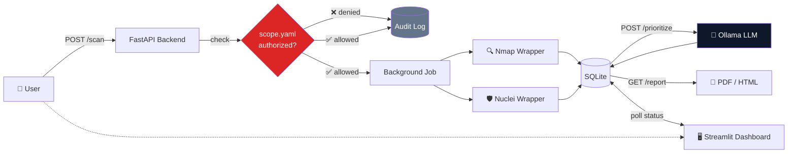

<div align="center">

# 🛡️ AutoRed

### AI-Assisted Red Teaming Orchestrator

*Automated recon → vulnerability scanning → AI-prioritized findings → professional reports*

<br/>

[](https://python.org)
[](https://fastapi.tiangolo.com)
[](https://streamlit.io)
[](https://ollama.com)

[](LICENSE)
[](https://kali.org)
[]()

<br/>

**[Quick Start](#-quick-start)** · **[Features](#-features)** · **[Architecture](#-architecture)** · **[API](#-api-reference)** · **[Screenshots](#-screenshots)**

</div>

<br/>

---

## 💡 What is AutoRed?

AutoRed automates the core workflow of a red team engagement — the way a real security team would run it, minus the manual grunt work. Give it an authorized target, and it will:

```
  🔍 Recon (Nmap)  →  🛡️ Vuln Scan (Nuclei)  →  🤖 AI Prioritization  →  📄 PDF Report
```

Everything runs behind a **hard authorization boundary** — no target gets touched unless it's explicitly allow-listed, and every decision (allowed *or* denied) is written to an immutable audit log. This isn't a toy scanner; it's built the way a real security tool has to be built.

<br/>

## ✨ Features

<table>
<tr>
<td width="50%" valign="top">

### 🔐 Authorization-First Design
Every scan target is checked against a `scope.yaml` allowlist before anything runs. Fail-closed by default — no entry, no scan. Two independent enforcement checkpoints, so there's no path around it.

### ⚡ Async by Design
Scans and AI summarization both run as background jobs. Launch a scan, get a job ID back instantly, poll for results — no blocked requests, no timeouts.

### 🔍 Real Tool Integration
Wraps **Nmap** and **Nuclei** as async subprocesses, parsing their raw output (XML / JSONL) into clean, structured JSON.

</td>
<td width="50%" valign="top">

### 🤖 Local AI Prioritization
A local **Ollama** model reads the structured findings and produces a ranked, plain-language summary — reasoning over results only, never generating exploit code.

### 📄 Professional Reporting
One click turns any completed scan into a polished PDF or HTML report — cover page, severity-coded findings tables, AI executive summary.

### 🖥️ Full Dashboard
A Streamlit UI over the entire API — launch scans, watch live status, trigger AI summaries, download reports. No `curl` required.

</td>
</tr>
</table>

<br/>

## 🏗️ Architecture



**The golden rule:** every path to a scan goes through the scope check first. No exceptions, no bypasses.

<br/>

## 🧰 Tech Stack

| Layer | Technology |
|---|---|
| **Backend** | Python · FastAPI · SQLAlchemy · SQLite |
| **Recon** | Nmap *(async subprocess → structured JSON)* |
| **Vuln Scanning** | Nuclei *(JSONL output parsing)* |
| **AI Layer** | Ollama *(local LLM, direct HTTP API — no framework overhead)* |
| **Reporting** | Jinja2 + WeasyPrint *(HTML → PDF)* |
| **Frontend** | Streamlit |
| **Authorization** | YAML allowlist, fail-closed enforcement |

<br/>

## 🚀 Quick Start

```bash
# 1. Clone and enter the project
git clone https://github.com/chandanr7711/AUTO-RED.git
cd AUTO-RED

# 2. Set up the environment
python3 -m venv venv
source venv/bin/activate
pip install -r requirements.txt

# 3. Install external tools
sudo apt install nmap nuclei
nuclei -update-templates
curl -fsSL https://ollama.com/install.sh | sh
ollama pull llama3.2:1b
```

**Run the API:**
```bash
uvicorn backend.main:app --reload
```
→ Swagger docs at `http://localhost:8000/docs`

**Run the dashboard** *(separate terminal)*:
```bash
streamlit run frontend/dashboard.py
```
→ Opens at `http://localhost:8501`

> ⚠️ **Before scanning anything:** add your target to `backend/core/scope.yaml`. Only scan systems you own or have explicit written authorization to test.

<br/>

## 📡 API Reference

| Endpoint | Method | Description |
|---|---|---|
| `/scan` | `POST` | Launch a new scan job |
| `/scan/{id}` | `GET` | Poll job status & results |
| `/scan` | `GET` | List recent jobs |
| `/scan/{id}/prioritize` | `POST` | Kick off AI summarization (async) |
| `/scan/{id}/report` | `GET` | Generate PDF / HTML report |

<details>
<summary><strong>Example: launch a scan</strong></summary>

```bash
curl -X POST http://localhost:8000/scan \
  -H "Content-Type: application/json" \
  -d '{
    "target": "127.0.0.1",
    "scan_type": "full",
    "scope_confirmation": true,
    "requested_by": "your-name"
  }'
```

`scan_type`: `recon` (Nmap only) · `vuln` (Nuclei only) · `full` (both)

</details>

## 📁 Project Structure

```
AutoRed/
├── backend/
│   ├── main.py                FastAPI entrypoint
│   ├── core/
│   │   ├── scope.py           Authorization gate
│   │   ├── scope.yaml         Target allowlist
│   │   ├── audit.py           Immutable audit log
│   │   └── scan_runner.py     Job orchestration
│   ├── models/                SQLAlchemy + Pydantic schemas
│   └── routers/scan.py        API routes
├── tools/
│   ├── nmap_wrapper.py
│   └── nuclei_wrapper.py
├── ai/prioritizer.py          Ollama integration
├── reports/                   Jinja2 + WeasyPrint report generation
└── frontend/dashboard.py      Streamlit UI
```

<br/>

## 🗺️ Roadmap

- [ ] Celery + Redis for durable, concurrent job processing
- [ ] Alembic database migrations
- [ ] Additional tool wrappers (`ffuf`, `sqlmap`)
- [ ] Historical findings trend view

<br/>

## ⚖️ Responsible Use

This tool is built for **authorized security testing only**. Every scan requires explicit entry in `scope.yaml` and confirmation at request time. Scanning systems without authorization is illegal in most jurisdictions. Use it on your own infrastructure, CTF environments, or engagements with signed written authorization.

<br/>

---

<div align="center">

Built by **Chandan** · [GitHub](https://github.com/chandanr7711)

</div>
